# 🦻 Hearing Aid Platform

A comprehensive **Progressive Web Application (PWA)** that provides an augmented reality experience for visualizing hearing aids, complete with hearing tests, appointment booking, and personalized audiologist consultations.

<div align="center">


*Modern, responsive interface accessible across all devices*

</div>

## ✨ Key Features

### 🌐 Multi-Platform Access
- **Progressive Web App**: Install on any device for native app experience
- **Cross-Platform Compatibility**: Works seamlessly on desktop, tablet, and mobile
- **Offline Support**: Core functionality available without internet connection

### 🥽 Advanced AR Experience
- **iOS Quick Look AR**: Native AR experience on Apple devices
- **WebXR Support**: Cutting-edge AR on compatible browsers
- **Virtual Try-On**: See how hearing aids look on your ears in real-time
- **3D Model Viewer**: Interactive product exploration

<div align="center">

| Mobile AR Try-On | Desktop AR Experience |
|:---:|:---:|
| 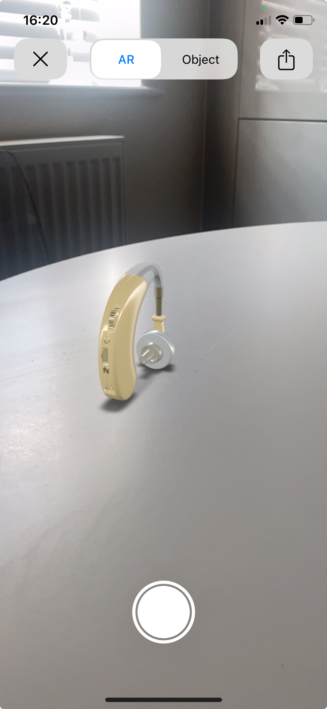 | 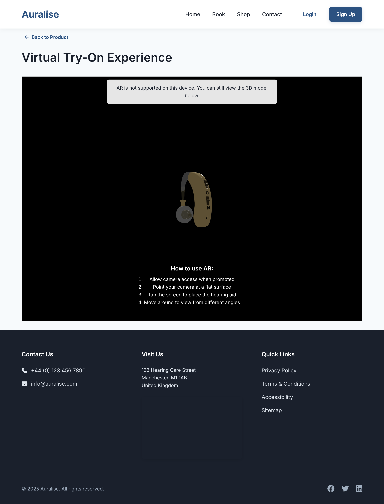 |

</div>

### 🩺 Comprehensive Hearing Assessment
- **Online Hearing Tests**: Professional-grade audiometry testing
- **Tone Detection Tests**: Frequency-specific hearing evaluation
- **Speech-in-Noise Testing**: Real-world hearing scenario assessment
- **Personalized Results**: Detailed hearing profiles and recommendations

<div align="center">

| Tone Test | Speech-in-Noise Test | Test Results |
|:---:|:---:|:---:|
| 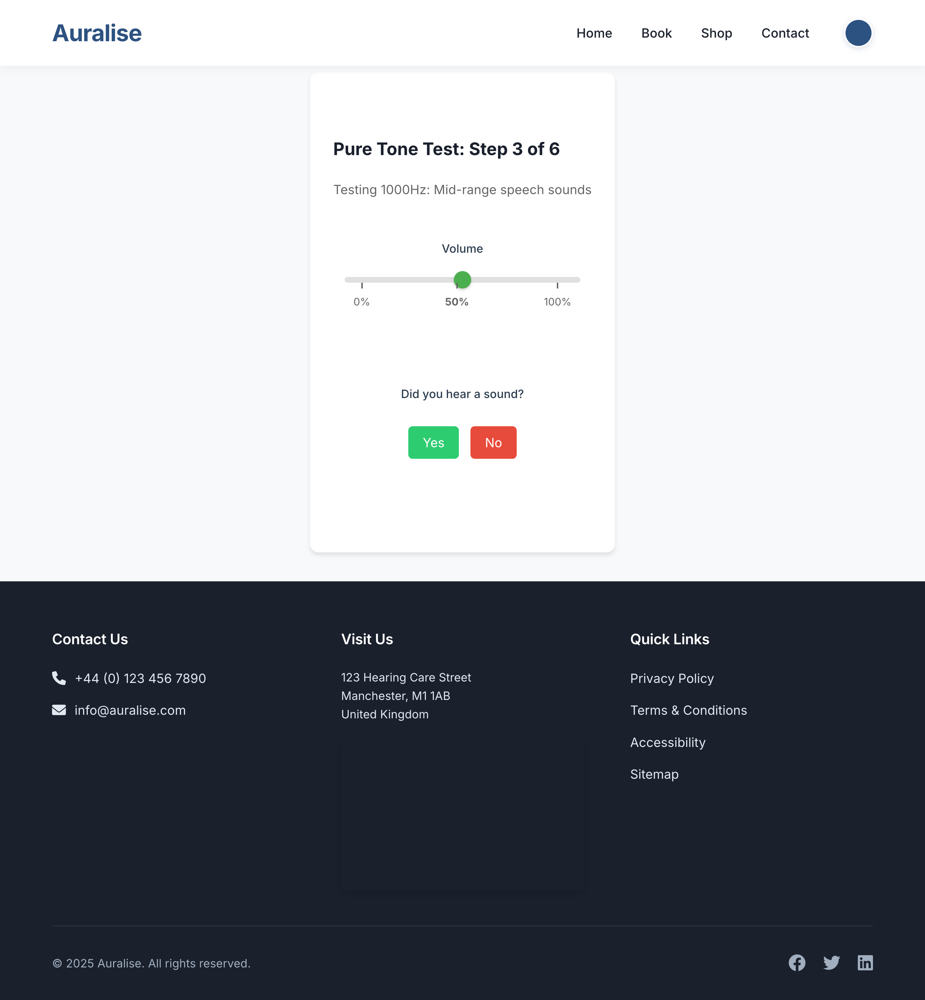 | 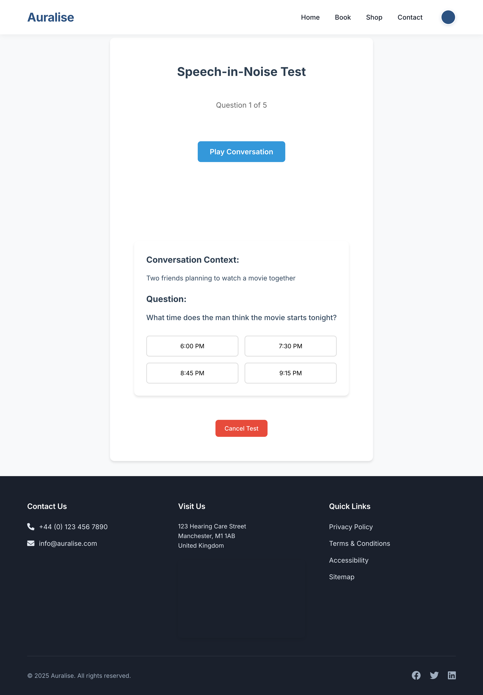 | 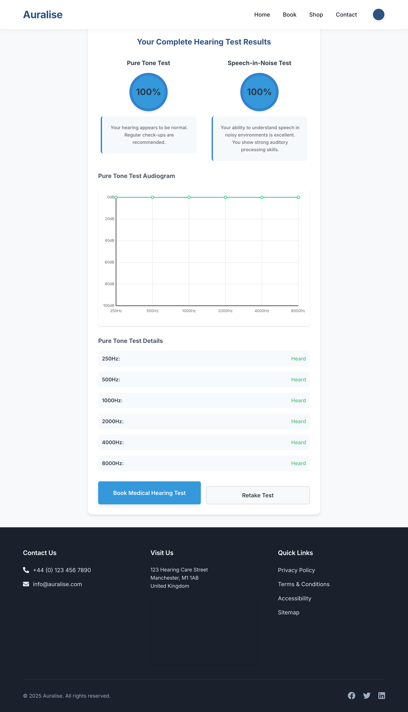 |

</div>

### 👩‍⚕️ Professional Services
- **Audiologist Network**: Connect with certified hearing professionals
- **Easy Appointment Booking**: Streamlined scheduling system
- **Appointment Management**: Track and manage your consultations

<div align="center">

| Audiologist Selection | Booking Interface | Appointment History |
|:---:|:---:|:---:|
| 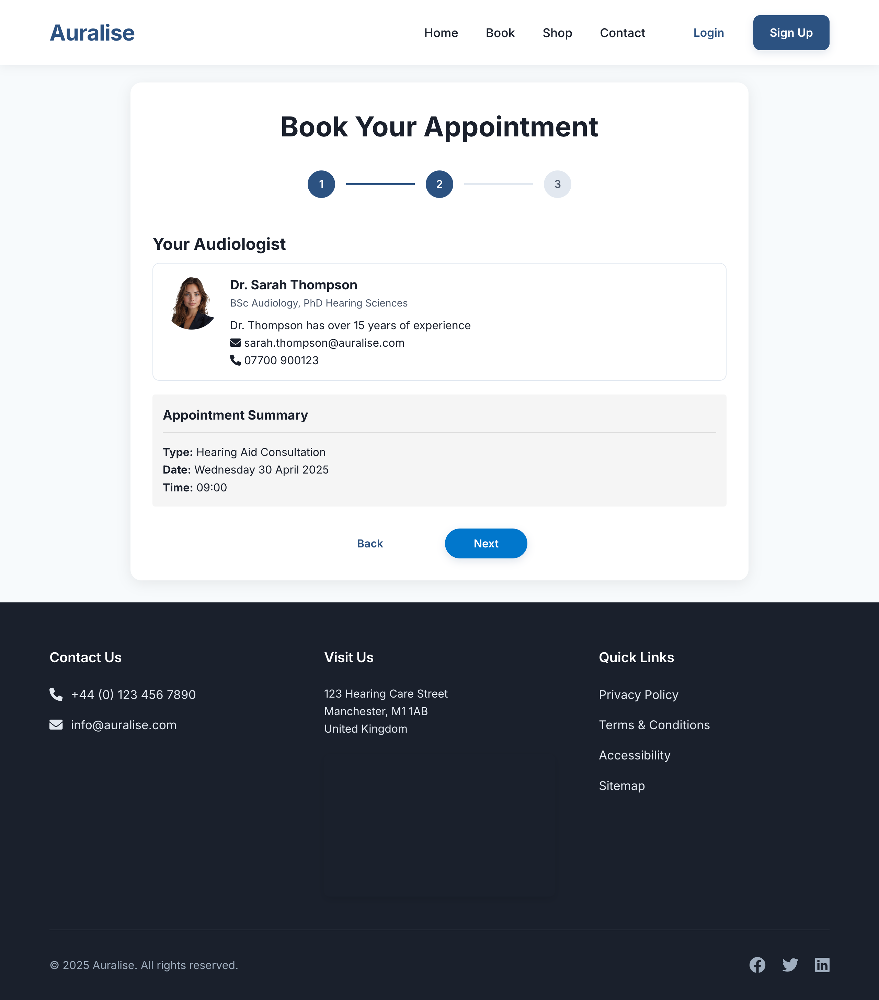 | 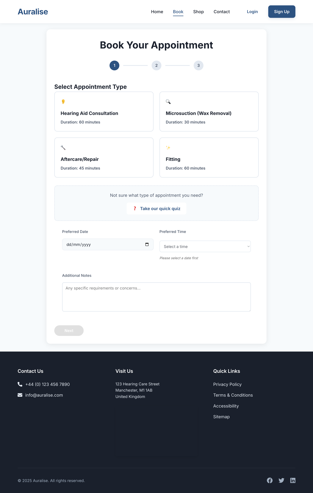 | 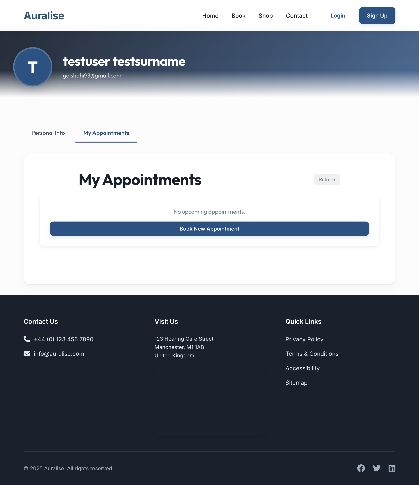 |

</div>

---

## 🚀 Quick Start Guide

### Prerequisites

Ensure you have the following installed:

- **Node.js** (v16 or higher)
- **JDK 11+** (for Kotlin backend)
- **Azure Account** (for Cosmos DB)
- **Firebase Account** (for authentication & services)

### 📥 Installation

1. **Clone the Repository**
   ```bash
   git clone https://github.com/ngolshahi/hearing-aid-platform.git
   cd hearing-aid-platform
   ```

2. **Backend Setup**
   ```bash
   cd backend
   ./gradlew build
   ```

3. **Frontend Setup**
   ```bash
   cd frontend
   npm install
   ```

---

## ⚙️ Configuration

### Backend Environment Variables

Create `.env` in the backend directory:

```bash
# Azure Cosmos DB Configuration
AZURE_COSMOS_DB_URI="your_cosmos_db_uri"
AZURE_COSMOS_DB_KEY="your_cosmos_db_key"
AZURE_COSMOS_DB_DATABASE="HearingAidDB"

# Container Names
USERS_CONTAINER="users"
HEARING_AID_CONTAINER="hearingAids"
APPOINTMENTS_CONTAINER="appointments"
AUDIOLOGISTS_CONTAINER="audiologists"
APPOINTMENT_TYPES_CONTAINER="appointmentTypes"

# Azure Computer Vision (Optional - for enhanced AR)
AZURE_VISION_KEY="your_vision_api_key"
AZURE_VISION_ENDPOINT="your_vision_endpoint"
```

### Frontend Environment Variables

Create `.env` in the frontend directory:

```bash
# Firebase Configuration
VITE_FIREBASE_API_KEY=your_firebase_api_key
VITE_FIREBASE_AUTH_DOMAIN=your_firebase_auth_domain
VITE_FIREBASE_PROJECT_ID=your_firebase_project_id
VITE_FIREBASE_STORAGE_BUCKET=your_firebase_storage_bucket
VITE_FIREBASE_MESSAGING_SENDER_ID=your_firebase_messaging_sender_id
VITE_FIREBASE_APP_ID=your_firebase_app_id
VITE_FIREBASE_MEASUREMENT_ID=your_firebase_measurement_id

# Azure Speech Services
VITE_AZURE_SPEECH_KEY=your_azure_speech_key
VITE_AZURE_SPEECH_REGION=your_azure_speech_region
```

---

## 🏃‍♂️ Running the Application

### Development Mode

1. **Start Backend Server**
   ```bash
   cd backend
   ./gradlew run
   ```
   Backend will be available at `http://localhost:8080`

2. **Start Frontend Development Server**
   ```bash
   cd frontend
   npm run dev
   ```
   Frontend will be available at `https://localhost:5173`

### Production Build

```bash
cd frontend
npm run build
npm run preview
```

---

## 📱 User Interface Showcase

### Authentication & User Management

<div align="center">

| Login (Desktop) | Login (Mobile) | Registration |
|:---:|:---:|:---:|
| 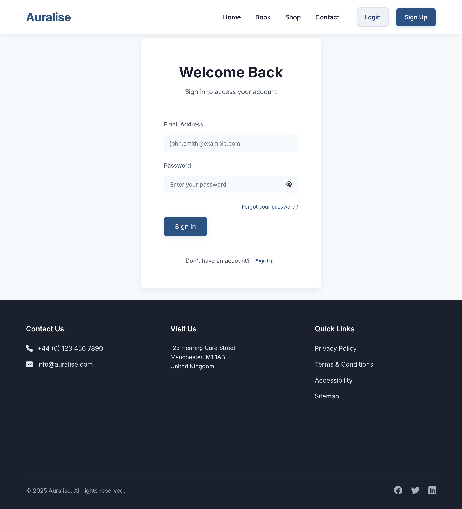 | 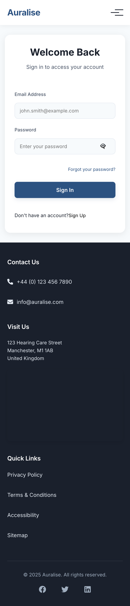 | 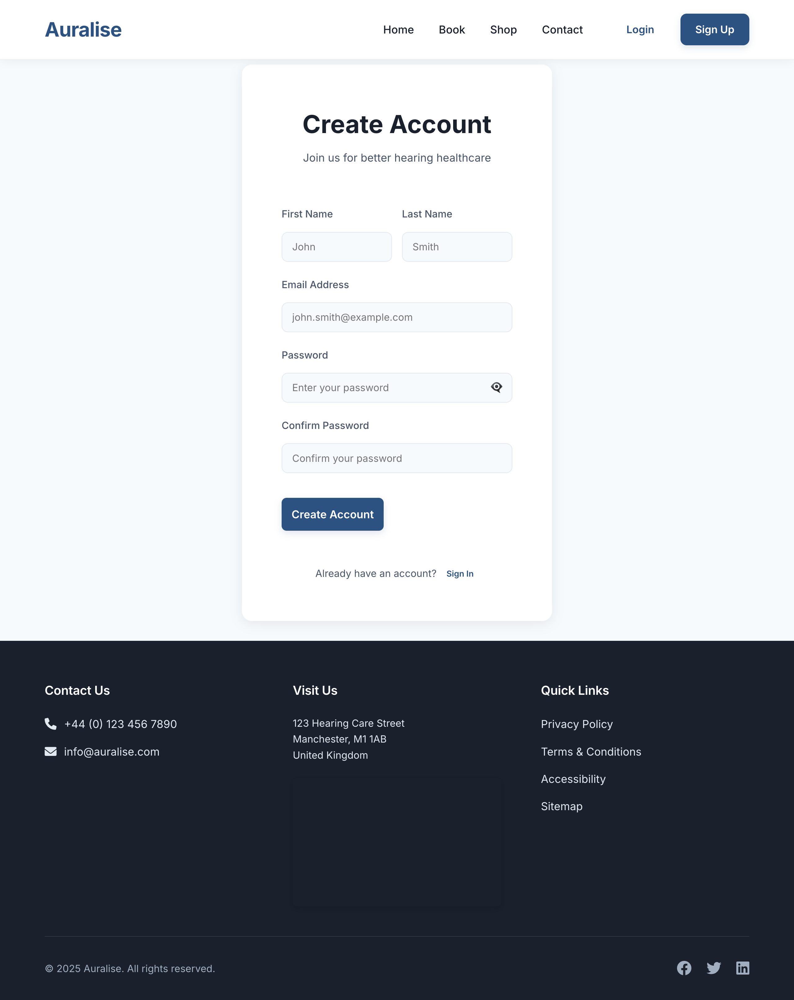 |

| OTP Verification | Email OTP | User Profile |
|:---:|:---:|:---:|
| 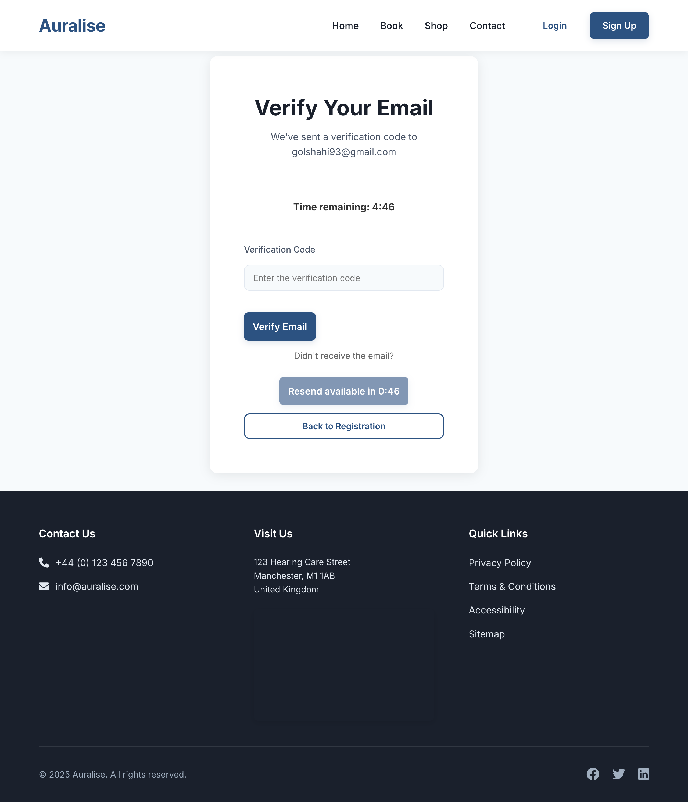 | 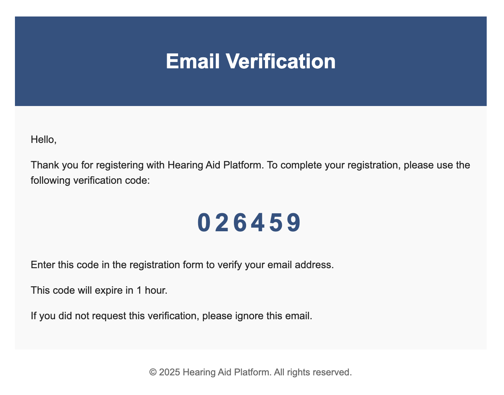 | 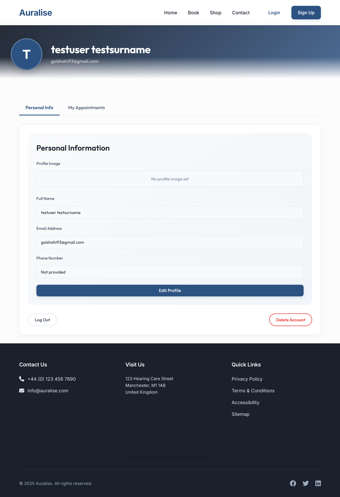 |

</div>

### Shopping Experience

<div align="center">

| Shop (Desktop) | Shop (Mobile) | Product Details |
|:---:|:---:|:---:|
| 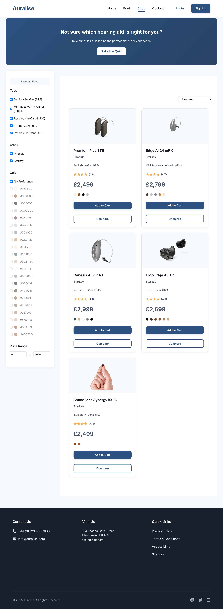 | 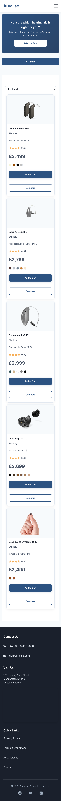 | 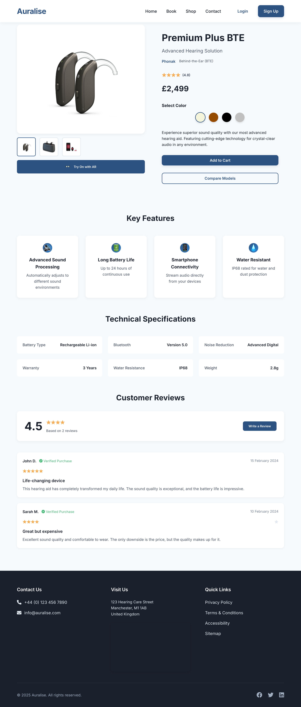 |

</div>

### Mobile Experience

<div align="center">

| Mobile Navigation | Mobile Home | Mobile Setup |
|:---:|:---:|:---:|
| 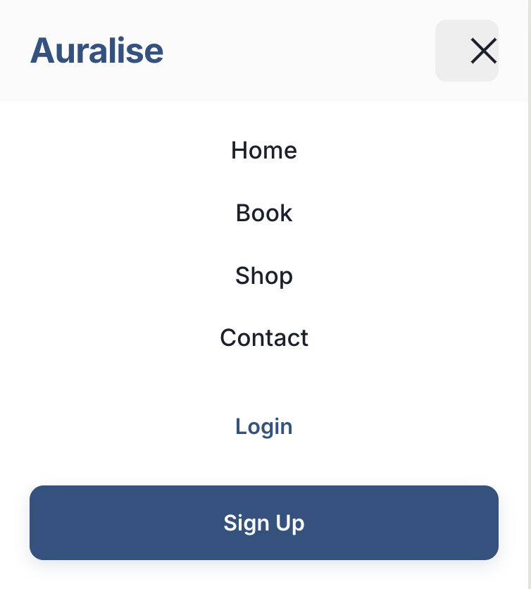 |  | 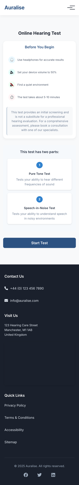 |

</div>

---

## 🥽 AR Try-On Technology

### How It Works

#### Mobile Real-Time AR
- **Camera Integration**: Access device camera for live video feed
- **Real-Time Processing**: Frame-by-frame ear detection and tracking
- **Overlay Rendering**: Dynamic hearing aid placement and visualization
- **Multi-Camera Support**: Switch between front and rear cameras

#### Desktop Image Processing
- **Image Upload**: Support for various image formats
- **AI-Powered Detection**: Advanced ear recognition algorithms
- **Precise Placement**: Accurate hearing aid positioning
- **Color Visualization**: Multiple style and color options

### AR Implementation Details

#### Detection Methods
1. **Azure Computer Vision API** (Recommended)
   - Machine learning-based ear detection
   - High accuracy across diverse conditions
   - Robust lighting and angle tolerance

2. **Color-Based Detection** (Fallback)
   - Skin tone analysis for ear identification
   - Basic geometric shape recognition
   - Suitable for controlled environments

#### Supported Platforms
- **iOS**: Native Quick Look AR experience
- **Android**: WebXR-based AR implementation
- **Desktop**: 3D model viewer with image processing
- **Fallback**: Interactive 3D model for all devices

---

## 📊 Hearing Test Features

### Test Types Available

1. **Pure Tone Audiometry**
   - Frequency-specific hearing assessment
   - Threshold detection across hearing range
   - Professional-grade calibration

2. **Speech-in-Noise Testing**
   - Real-world hearing scenario simulation
   - Background noise adaptation testing
   - Comprehension accuracy measurement

3. **Comprehensive Analysis**
   - Detailed hearing profile generation
   - Personalized recommendations
   - Progress tracking over time

---

## 📅 Appointment System

### Features
- **Smart Scheduling**: AI-powered appointment optimization
- **Multi-Provider Network**: Extensive audiologist database
- **Automated Reminders**: Email and push notifications
- **Telehealth Integration**: Virtual consultation options
- **History Tracking**: Complete appointment records

<div align="center">

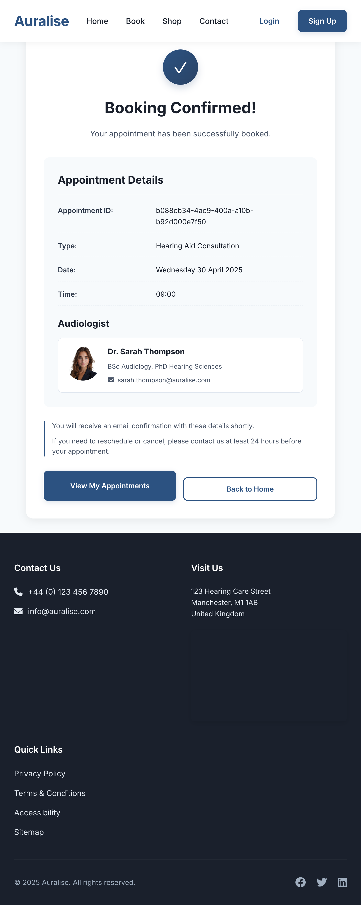

*Streamlined appointment confirmation process*

</div>

---

## 🏗️ Technical Architecture

### Frontend Stack
- **React 18+**: Modern component-based UI
- **TypeScript**: Type-safe development
- **Vite**: Lightning-fast build tool
- **Tailwind CSS**: Utility-first styling
- **PWA**: Service workers for offline support

### Backend Stack
- **Kotlin**: Modern JVM language
- **Ktor**: Lightweight web framework
- **Azure Cosmos DB**: NoSQL database
- **Firebase**: Authentication & real-time features

### Cloud Services
- **Azure Computer Vision**: AI-powered image analysis
- **Azure Speech Services**: Audio processing
- **Firebase Auth**: Secure user management
- **Azure Cosmos DB**: Scalable data storage

---

## 🔧 Troubleshooting

### Common Issues

#### Backend Won't Start
- ✅ Verify all environment variables in `.env`
- ✅ Check Azure Cosmos DB connectivity
- ✅ Ensure JDK 11+ is installed
- ✅ Validate database permissions

#### Frontend Loading Problems
- ✅ Confirm React dev server is running on port 5173
- ✅ Check browser console for errors
- ✅ Verify Firebase configuration
- ✅ Clear browser cache and cookies

#### AR Features Not Working
- ✅ Grant camera permissions in browser
- ✅ Use HTTPS for camera access
- ✅ Test on AR-compatible devices
- ✅ Check WebXR browser support

#### Database Connection Issues
- ✅ Validate Azure Cosmos DB credentials
- ✅ Check network connectivity
- ✅ Verify container names and database structure
- ✅ Review Azure portal for service status

---

## 🚀 Deployment

### Production Deployment Steps

1. **Environment Setup**
   ```bash
   # Build frontend for production
   cd frontend
   npm run build
   
   # Build backend
   cd ../backend
   ./gradlew build
   ```

2. **Cloud Deployment**
   - Configure Azure App Service for backend
   - Deploy frontend to CDN (Azure Static Web Apps recommended)
   - Set up custom domain and SSL certificates
   - Configure environment variables in production

3. **PWA Configuration**
   - Ensure service worker is properly configured
   - Test offline functionality
   - Validate manifest.json for app installation

---

## 📄 License

This project is licensed under the MIT License - see the [LICENSE](LICENSE) file for details.

---
